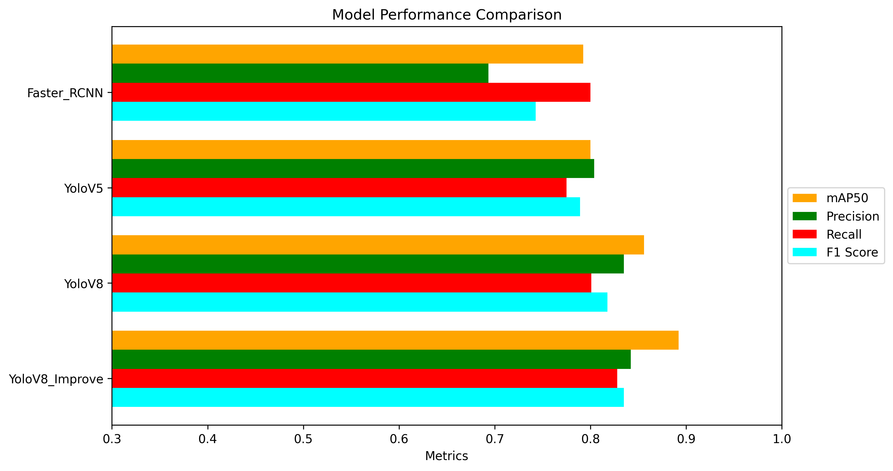
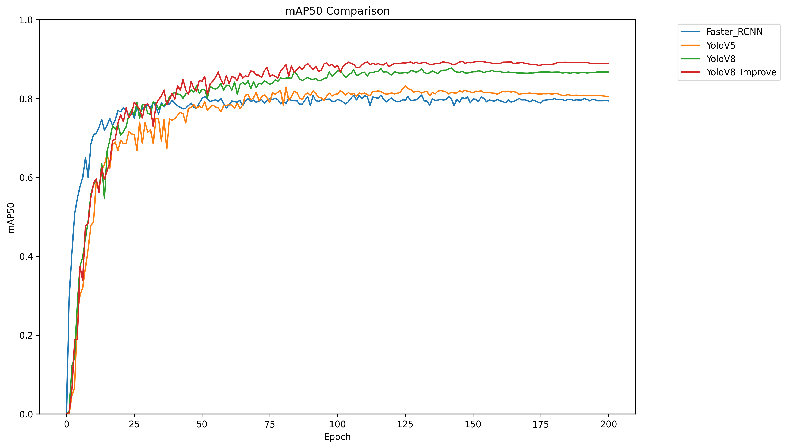
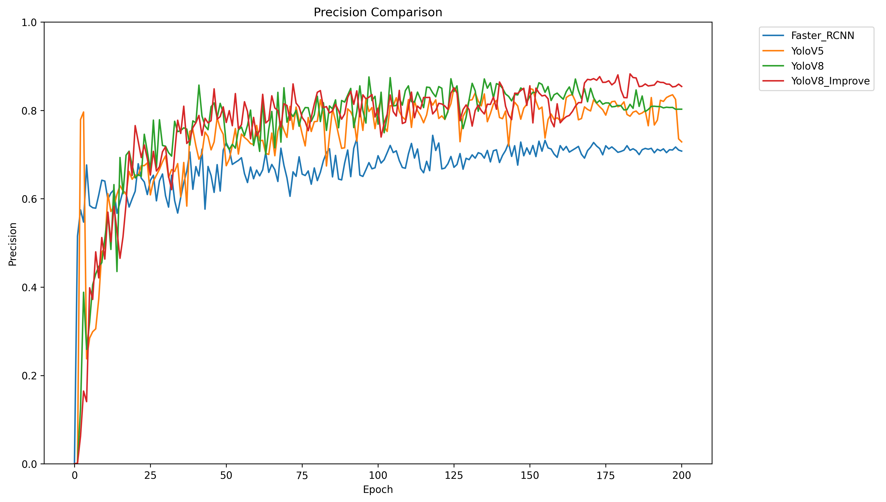
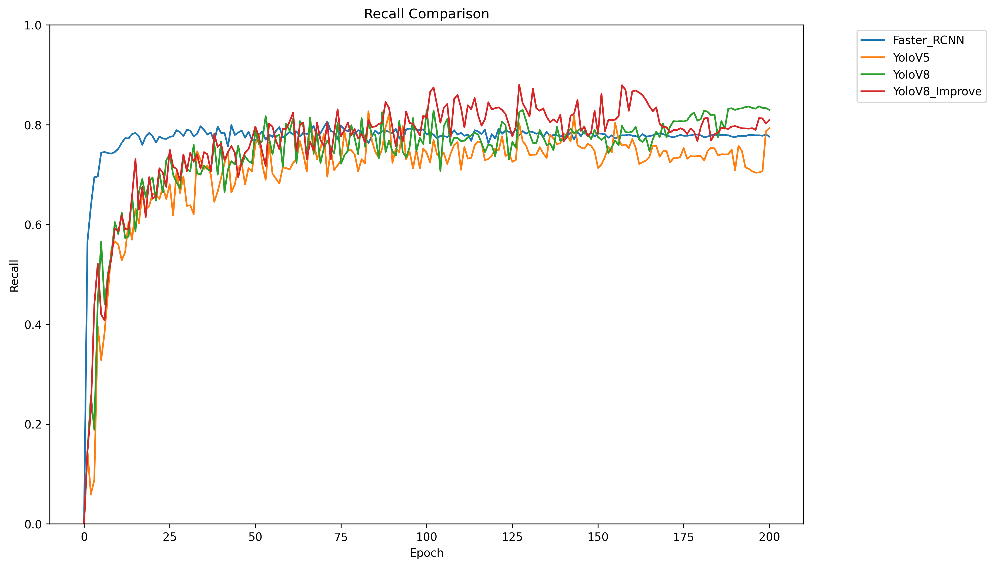
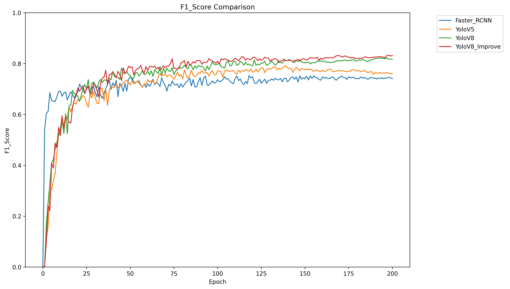

# Apple Fruit Recognition and Grading System

本项目为西北农林科技大学信息工程学院 2024 年度校级大学生科创项目，面向苹果果实的目标检测、定位识别与品级判定任务。仓库整理了可运行的简易图形界面、YOLO 系列模型训练与验证代码、Faster R-CNN 对比实验代码，以及实验结果可视化脚本。

> 说明：为控制仓库体积，数据集、训练输出、模型权重和复杂版 UI 模块未上传至 GitHub。当前仓库主要保留可复现实验代码、结果分析文件以及可运行的 `UI_module_simple` 简易演示界面。

## 功能概览

- **图形化检测演示**：基于 PyQt5 与 Ultralytics YOLO，支持图片检测、视频文件检测和摄像头实时检测。
- **苹果品级统计**：检测完成后自动统计苹果总数，并按好果、中等果、次等果进行分类展示。
- **多模型对比实验**：包含 YOLOv5、YOLOv8、改进版 YOLOv8 和 Faster R-CNN 等模型的训练与验证代码。
- **数据处理工具集**：提供 XML/TXT 标注格式转换、数据集划分、MixUp/Mosaic 数据增强等辅助脚本。
- **实验结果可视化**：内置模型性能对比曲线图与柱状图绘制脚本，便于分析不同模型表现。

## 仓库结构

```text
Apple_Grading_Detection/
├── UI_module_simple/       # 当前可运行的简易图形界面
├── YoloV5/                 # YOLOv5 训练、验证、推理代码
├── YoloV8/                 # YOLOv8 训练与验证代码
├── YoloV8_Improve/         # 改进版 YOLOv8 训练与验证代码
├── Faster_Rcnn/            # Faster R-CNN 对比实验代码
├── Fig/                    # 实验结果 CSV 与绘图脚本
├── requirement.txt         # Python 依赖列表
└── README.md
```

以下内容因体积较大或属于本地运行产物，未上传至 GitHub：

- `DataSet/`、`数据集/`：本地数据集目录
- `runs/`、`logs/`、`map_out/`：训练/验证输出
- `*.pt`、`*.pth`、`*.torchscript`：模型权重文件
- `UI_module_complex/`：复杂版 UI 模块
- `local_archives/`、`*.zip`：本地压缩包

## 环境要求

- Windows / Linux 均可运行，项目主要在 Windows 环境下开发与测试
- 推荐使用 Python 3.9
- PyTorch 需根据本机 CUDA 版本单独安装
- CUDA GPU 非必需，但模型训练阶段推荐使用 GPU 加速

安装依赖：

```bash
pip install -r requirement.txt
```

如需使用 GPU，请先根据本机 CUDA 版本从 PyTorch 官网安装对应版本的 `torch` 与 `torchvision`，再安装本项目依赖。

## 运行简易 UI

当前推荐运行 `UI_module_simple/window.py` 作为演示入口。

```bash
cd UI_module_simple
python window.py
```

界面支持以下功能：

1. **图片检测**：上传单张苹果图片并输出检测结果。
2. **视频检测**：选择本地视频文件并进行逐帧检测。
3. **摄像头实时监测**：调用默认摄像头完成实时识别。
4. **品级统计**：根据检测类别统计好果、中等果和次等果数量。

### 模型文件说明

由于权重文件较大，GitHub 仓库中未包含模型权重。运行 UI 前，请将训练好的模型权重放置到：

```text
UI_module_simple/best.pt
```

如果未找到 `best.pt`，程序会尝试加载 `yolov8n.pt` 作为备选模型。需要注意的是，该模型并非本项目训练得到的苹果分级模型，仅适合用于验证程序是否能够正常启动。

## 类别说明

项目默认使用 4 类苹果目标，类别定义如下：

| 类别 ID | 英文标签 | 中文含义 | UI 统计归类 |
| --- | --- | --- | --- |
| 0 | `disease_apple` | 病害苹果 | 中等 |
| 1 | `good_apple` | 好果 | 好果 |
| 2 | `rotten_apple` | 腐烂苹果 | 次等 |
| 3 | `soso_apple` | 一般苹果 | 中等 |

## 数据集说明

数据集未随仓库上传。训练时请将数据集放置到本地 `DataSet/` 目录，并保持如下 YOLO 数据集结构：

```text
DataSet/
├── images/
│   ├── train/
│   ├── val/
│   └── test/
└── labels/
	├── train/
	├── val/
	└── test/
```

标注格式为 YOLO TXT：

```text
class_id x_center y_center width height
```

其中坐标均为归一化后的相对坐标。

## 模型训练与验证

### YOLOv8

训练：

```bash
cd YoloV8
python yoloV8-train.py
```

验证：

```bash
cd YoloV8
python yoloV8-val.py
```

数据配置文件：`YoloV8/my_data.yaml`。

### 改进版 YOLOv8

训练：

```bash
cd YoloV8_Improve
python yoloV8-train.py
```

验证：

```bash
cd YoloV8_Improve
python yoloV8-val.py
```

数据配置文件：`YoloV8_Improve/my_data.yaml`。

### YOLOv5

YOLOv5 相关代码位于 `YoloV5/`，数据配置文件为 `YoloV5/data/my_data.yaml`。使用前请根据本地 `DataSet/` 实际路径检查并修改其中的 `path` 字段。

### Faster R-CNN

Faster R-CNN 相关代码位于 `Faster_Rcnn/`，主要用于模型对比实验。训练前需准备 VOC 格式数据集，并按脚本要求配置类别文件和权重路径。

## 模型性能指标

由于 GitHub 仓库未上传数据集与模型权重，在线仓库无法直接复现实验评估。下表指标来源于 `Fig/` 目录中保存的历史实验 CSV 记录，统计方式为各模型训练过程中 **val_map 最高的轮次**。

| 模型 | 最佳轮次 | mAP | Precision | Recall | F1 |
| --- | ---: | ---: | ---: | ---: | ---: |
| YOLOv5 | 126 | 0.83207 | 0.85090 | 0.72572 | 0.78334 |
| YOLOv8 | 143 | 0.87719 | 0.83712 | 0.79163 | 0.81374 |
| YOLOv8_Improve | 147 | **0.89442** | 0.83832 | 0.79618 | 0.81671 |
| Faster R-CNN | 132 | 0.80884 | 0.69930 | 0.78497 | 0.73966 |

最终训练轮次指标如下，可用于观察模型在训练结束时的状态：

| 模型 | Final mAP | Final Precision | Final Recall | Final F1 |
| --- | ---: | ---: | ---: | ---: |
| YOLOv5 | 0.80553 | 0.72870 | 0.79313 | 0.75955 |
| YOLOv8 | 0.86701 | 0.80271 | 0.82960 | 0.81593 |
| YOLOv8_Improve | **0.88930** | **0.85415** | 0.80959 | **0.83127** |
| Faster R-CNN | 0.79421 | 0.70782 | 0.77625 | 0.74046 |

从实验结果可以看出，改进版 YOLOv8 在最佳 mAP 和最终 F1 上均取得了较优表现，更适合作为系统默认检测模型。

## 实验结果绘图

`Fig/` 目录中包含模型实验结果 CSV 和绘图脚本：

- `绘制对比曲线图.py`
- `绘制对比柱状图.py`
- `Faster_RCNN.csv`
- `YoloV5.csv`
- `YoloV8.csv`
- `YoloV8_Improve.csv`

上述文件可用于生成不同模型的性能对比图。

### 模型对比图表

综合测试性能对比：



mAP50 对比曲线：



Precision 对比曲线：



Recall 对比曲线：



F1 Score 对比曲线：



## GitHub 上传说明

当前 GitHub 仓库仅上传源代码和轻量资源，不包含数据集、训练结果和模型权重。若需要完整运行检测效果，请自行补充以下文件：

1. 数据集：放入本地 `DataSet/` 目录。
2. UI 权重：放入 `UI_module_simple/best.pt`。
3. 各模型训练权重：放入对应模型目录下的本地 `runs/` 或 `weights/` 路径。

## 作者

- ChenykBeta

## License

MIT License

## 致谢

感谢李宏利老师的指导，以及项目组成员在数据集整理、模型训练、系统开发和实验分析等方面所做的工作。
